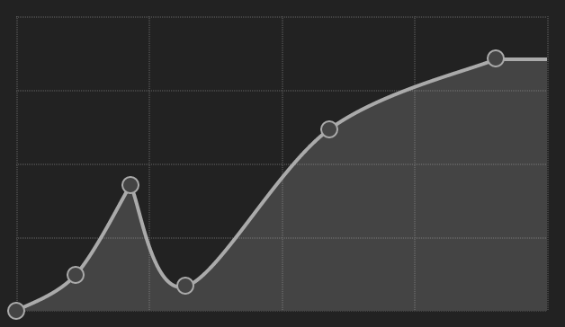

## Uniform Cubic Spline Interpolation & Inversion

[](https://docs.rs/uniform-cubic-splines/)
[](https://crates.io/crates/uniform-cubic-splines)

This crate supports the following types of splines:
* [B-spline](https://en.wikipedia.org/wiki/B-spline)
* [Bezier](https://en.wikipedia.org/wiki/Composite_B%C3%A9zier_curve)
* [Catmull-Rom](https://en.wikipedia.org/wiki/Cubic_Hermite_spline#Catmull%E2%80%93Rom_spline)
* [Hermite](https://en.wikipedia.org/wiki/Cubic_Hermite_spline)
* Linear
* Power



*Curve widget with a 1D Catmull-Rom spline with non-uniform knot
spacing and knot multiplicity using this crate for interpolation
(drawn using `tiny-skia`).*

The crate uses generics to allow interpolation of any type for which
certain traits are defined.

I.e. you can use this crate to interpolate splines in 1D, 2D, 3D, etc.

# Example
Using a combination of `spline()` and `spline_inverse()` it is
possible to compute a full spline-with-nonuniform-abscissæ:
```rust
use uniform_cubic_splines::{
    spline, spline_inverse, basis::CatmullRom
};

// We want to evaluate the spline at knot value 0.3.
let x = 0.3;

// The first and last points are never interpolated.
let knot_spacing = [0.0, 0.0, 0.1, 0.3, 1.0, 1.0];
let knots        = [0.0, 0.0, 1.3, 4.2, 3.2, 3.2];

let v = spline_inverse::<CatmullRom, _>(x, &knot_spacing).unwrap();
let y = spline::<CatmullRom, _, _>(v, &knots);

assert!(y - 4.2 < 1e-6);
```

# Background
The code is a Rust port of the implementation found in the [Open
Shading Language](https://github.com/imageworks/OpenShadingLanguage)
C++ source.

If you come from a background of computer graphics/shading
languages used in offline rendering this crate should feel like
home.
